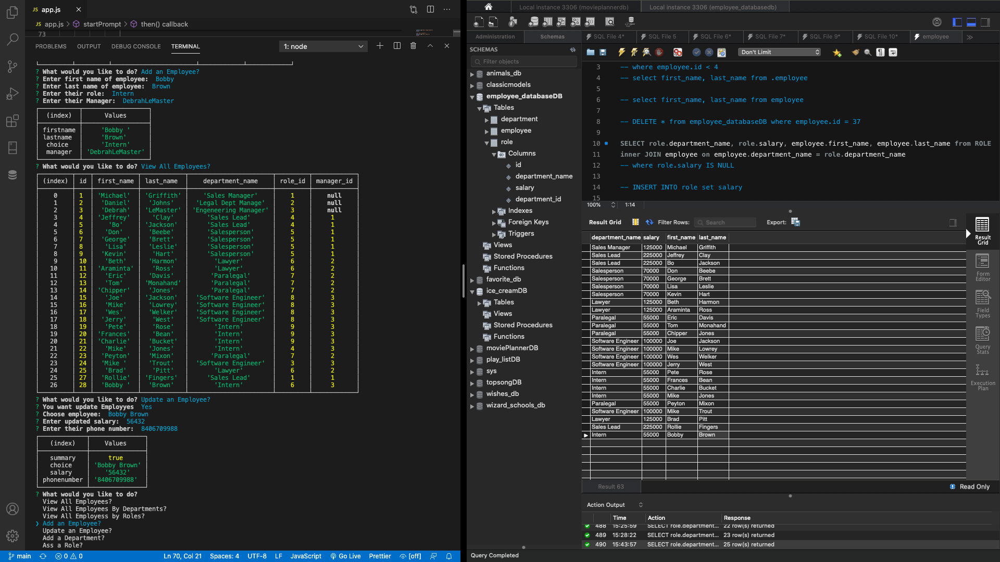
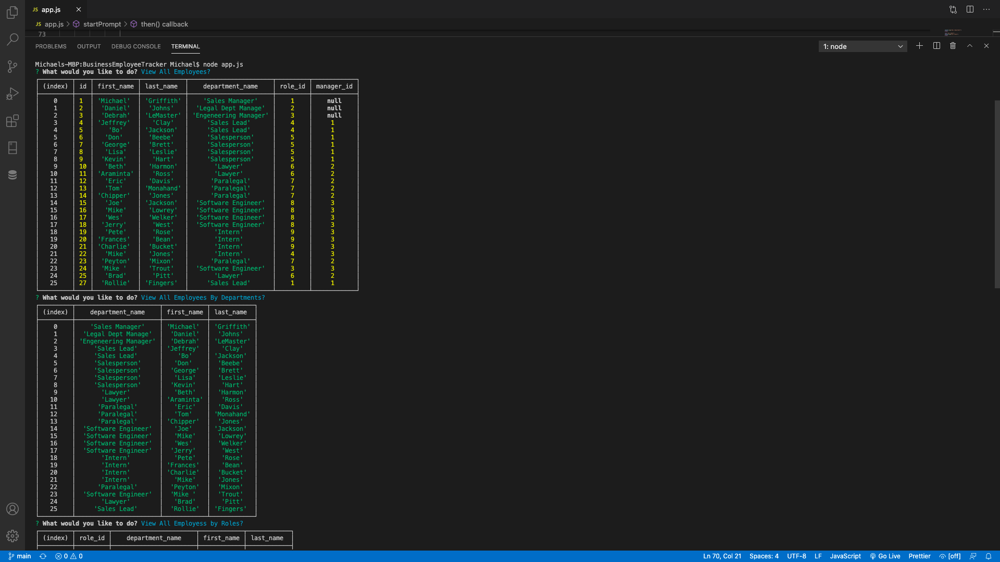

  <h1 align="center">Business Employee Tracker</h1>

## Description
  Employee Tracker is a CLI application for building and maintaining companies employee data base. Built on MySQL and leveraging modularity with a companies growth without reconfiguring the core structure of the internal employee data base. Employee allows managers or someone within the company to view all employees, roles, as well as departments. It also allows for adding employees, roles, departments and updating employees all from your CLI.

## Table Of Contents
- [Description](#discriptionOfProject)
- [Installation](#installationOfProject)
- [Usage](#usageOfProject)
- [License](#licenseOfProject)
- [Test](#testOfProject)
- [Issues](#issuesOfProject)
- [Contributors](#contributorsOfProject)

 

## Installation
  In order to use this application you will need to first run an npm install in your CLI to install the dependencies that have been loaded into the json files for you.

## Usage
  To use in a growing company allowing you to modify the database as needed and track employees based on condition you may set.

## License
  MIT

  This application is covered by the MIT license.

## Test
  n/a

## Issues
  n/a

## Contributors
  Just myself, Michael Griffith

## Github
  GriffMike167

## Email
  griffithcmichael@gamil.com

